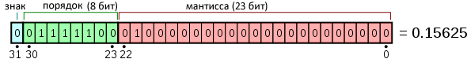

## Вопрос 13. Представление данных в оперативной памяти. Хранение переменных в Стеке

### Представление данных в памяти

**Бит** — это самая маленькая единица измерения информации. Биты складываются в байты, те — в килобайты, мегабайты и так далее. Название произошло от слов binary digit, двоичное число. Это значит, что в одном бите может храниться одно из двух значений: 0 или 1.

**Байт** — единица хранения и обработки цифровой информации; совокупность битов, обрабатываемая компьютером одновременно.

Под **адресом** будем понимать номер начального байта.

Различные данные представляются в оперативной памяти компьютера различным образом.

#### Целые числа

Беззнаковые целые числа просто хранятся в памяти компьютера в двоичном коде. Однако знаковые числа требуют хранения особым образом, для однозначного разделения отрицательных и положительных чисел. Существуют 3 стандартных способа хранения отрицательных чисел: прямой код, обратный код и дополнительный код.

1) Прямой код (англ. *sign and magnitude*).

    Старший бит двоичной записи числа называется знаковым битом. Если он установлен, число считается отрицательным, иначе положительным. Имеет проблему 2 нулей ($10000000_2=00000000_2=0_{10}$) и невозможности напрямую проводить арифметические операции ($5_{10}(00000101_2) + -5_{10}(10000101_2) = 10001010_2 \ne 0_{10}$).

2) Обратный код (англ. *one's complement*).

    Отрицательные числа кодируются как побитовая инверсия противоположных положительных чисел. Имеет проблему 2 нулей ($00000000_2=11111111_2=0_{10}$).

3) Дополнительный код (англ. *two's complement*)

    Отрицательные числа кодируются как побитовая инверсия положительных чисел плюс число 1. Не имеет названных проблем (только 1 ноль, арифметика стандартна).

Начиная с **С++20** единственной разрешенной формой кодирования знаковых отрицательных чисел в С++ является **дополнительный код**.

#### Вещественные числа

Стандарт не регламентирует строго формат хранения вещественных чисел, однако на фактически всех современных пользовательских и серверных платформах они представлены числами **IEEE 754**.

**IEEE 754** регламентирует
1) Двоичное представление чисел с плавающей запятой;
2) Допустимые операции над такими числами;
3) Их поведение при выполнении операций, в частности, методы округления;
4) Специальные значения (*NaN*, *infinity*).

В общем виде числа **IEEE 754** хранятся в памяти в следующем виде (на примере binary32, float в **С++**):

А представляются в виде 
- $(-1)^s \times 1.M \times 2^E$, если $E_{min} \le E \le E_{max}$ (нормализованные числа),
- $(-1)^s \times 0.M \times 2^{E_{min}}$, если $E=E_{min}-1$ (денормализованные числа),

где
- s - знак
- M - мантисса
- E - порядок (англ. exponent)

### Стек. Хранение локальных переменных

**Стек** - особая область памяти, работающая по принципу "первый зашел, последний вышел" (**FILO**), хранящая информацию о текущей подпрограмме и возврате из подпрограммы в вызвавшую программу (подпрограмму).

Структура, выравнивание, размер и положение стека в памяти определяется платформой; порядок вызова функций и хранение локальных переменных также определяется платформой. Обычно эти параметры определяются **двоичным интерфейсом приложения** (англ. **ABI** - **application binary interface**) платформы, а его часть касательно порядка вызова функций - **соглашением о вызовах** (англ. *calling convention*).

<!-- Например, на платформе *x86-64* (иначе *AMD64*), ОС *Unix/Linux, BSD, macOS* действует *System V ABI*:
1) Стек растет **от старших адресов к младшим**;
2) Стек выровнен по 16 байтам;
3) Размер стека изменяем, обычно составляет 8 MiB;
4) Часть аргументов передается в регистрах, оставшиеся - через стек, **в обратном порядке**. -->

Например, на *x86-64* стек растет от старших адресов к младшим:

Аргументы и локальные переменные функций также в общем случае хранятся на стеке. При входе в функцию на стеке под нее выделяется *кадр стека* - там хранятся переменные и аргументы, а также адрес возврата из функции. При выходе из функции кадр стека уничтожается (точнее, вершина стека перемещается вверх, за этот кадр, поэтому содержимое становится недоступным). Очистка памяти на стеке происходит автоматически, без участия программиста.