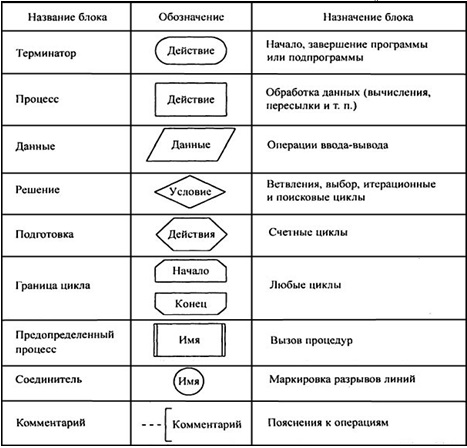

# Вопрос 14. Представление алгоритмов. Блок-схемы

**Алгоритм** – это точное предписание, определяющее вычислительный процесс, ведущий от варьируемых начальных данных к искомому результату.

Алгоритм может быть представлен различным образом:
1) Словесный;

    Предполагает описание алгоритма на естественном языке. Имеет существенный недостаток - строго не формализуем.
2) Формульно-словесный;

    Алгоритм записывается в виде текста с формулами по пунктам, определяющим последовательность действий.
3) **Блок-схемный**;
4) Псевдокод;

    *Псевдокод* - компактный, зачастую неформальный язык описания алгоритмов, использующий ключевые слова императивных языков программирования, но опускающий несущественные для понимания алгоритма подробности и специфический синтаксис.
5) Структурные диаграммы;

    *Структурные диаграммы* описывают структуру сложных объектов и систем, показывают статическую структуру системы и ее частей на разных уровнях абстракции и реализации, а также их взаимосвязь.
6) Языки программирования

    *Алгоритмический язык* — это искусственный язык (система обозначений), предназначенный для записи алгоритмов. Он позволяет представить алгоритм в виде текста, составленного по определенным правилам с использованием специальных служебных слов. Количество таких слов ограничено. Каждое служебное слово имеет точно определенный смысл, назначение и способ применения.

    **Язык программирования** - алгоритмический язык, команды которого однозначно преобразуются в команды для компьютера.

## Блок-схемы

**Блок–схема** — наглядный способ представления алгоритма. Блок–схема отображается в виде последовательности связанных между собой *функциональных блоков*, каждый из которых соответствует выполнению одного или нескольких действий. Определенному типу действия соответствует *определенная геометрическая фигура блока*. Линии, соединяющие блоки, определяют *очередность выполнения действий*. По умолчанию блоки соединяются *сверху вниз и слева направо*. Если последовательность выполнения блоков должна быть иной, используются направленные линии (стрелки).

Блок-схемы регламентируются такими документами, как **ГОСТ 19.701-90**, **СТП 01-2017** (стандарт предприятия БГУИР).

Пример блок-схемы алгоритма:

