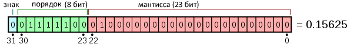
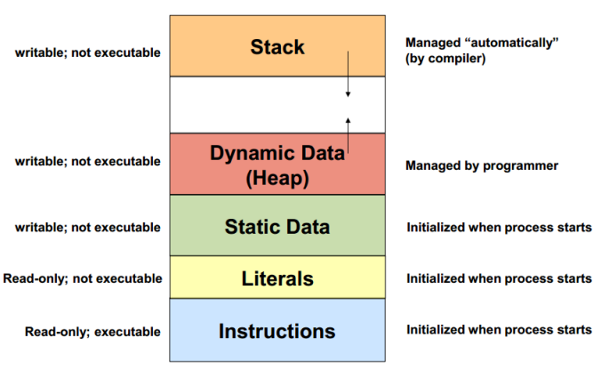

# Вопрос 1. Основные характеристики языка С++

**C++** - это компилируемый статически типизированный язык программирования общего назначения.
Язык программирования — это набор формальных правил, по которым пишутся программы.

Язык С++ **является**:
1) Компилируемым - программы, написанные на С++, перед выполнением сперва преобразуются в целевой (машинный) код целевой платформы - компилируется; за это отвечает специальная программа - компилятор. В результате получается исполнимый модуль, который уже может быть запущен на исполнение как отдельная программа;
2) Статически типизированным - за каждой переменной закреплен определенный **тип** - класс данных, характеризуемый членами класса и операциями, которые могут быть к ним применены. Тип переменной задается единожды при ее объявлении и не может быть изменен;
3) Слабо типизированным - значения разных, порой несвязных, типов в С++ можно приводить друг к другу встроенными в язык методами;
4) Высокоуровневым - программы на С++ проще в понимании человеком, чем с программы в машинных кодах и на языке ассемблера;
5) Мультипарадигмальным - С++ поддерживает несколько различных парадигм программирования - совокупностей идей и понятий, определяющих стиль написания программ, иными словами, парадигмы - подходы к программированию. В частности, С++ поддерживает:
    - Процедурное программирование - парадигма, при которой последовательно выполняемые операторы можно собрать в подпрограммы, то есть более крупные целостные единицы кода, с помощью механизмов самого языка;
    - Обобщенное программирование - парадигма, заключающаяся в таком описании данных и алгоритмов, которое можно применять к различным типам данных, не меняя само это описание;
    - **Объектно-ориентированное программирование** - парадигма, при котором программа рассматривается как набор объектов, взаимодействующих друг с другом. У каждого есть свойства и поведение;
7) Языком общего назначения - на С++ пишутся программы для различный сфер, начиная встраиваемыми системами и заканчивая разработкой игр. В качестве примера можно привести *драйверы* периферийных устройств, *операционные системы* и их компоненты, *браузеры*, *игры* и *игровые движки*, *базы данных*, *системы программирования*, в том числе *другие языки программирования* и библиотеки для них и т. д.

Язык С++ также обладает богатой стандартной библиотекой, включающей в том числе общеупотребительные структуры данных и алгоритмы.

С++ строго регламентирован Международной организации по стандартизации (ISO). На сегодняшний день выпущен стандарт С++23 и разрабатывается стандарт С++26.

<details>
  <summary>Комментарии автора</summary>
  TODO: Возможно, стоит добавить определения альтернативных подходов/терминов?
</details>

# Вопрос 10. Символьные и Строковые константы, отличие от числовых констант

## Символьные и строковые константы

**Константа** - это ограниченная последовательность символов алфавита языка, представляющая собой изображение фиксированного (неизменяемого) объекта.

Речь в первую очередь пойдет о *литералах* и их типах.

Символьные литералы представляют собой 1 символ (или часть символа, если говорить про UTF-*) в какой-либо кодировке.
В качестве символьных констант также могут использоваться управляющие коды, не имеющие графического представления. При этом код управляющего символа начинается с символа `\`(обратный слеш).

| Тип        | Пояснение                                                                                                                                                             | Пример  |
| ---------- | --------------------------------------------------------------------------------------------------------------------------------------------------------------------- | ------- |
| `char`     | ASCII. Также используется для хранения байт в многобайтных кодировках                                                                                          | `'a'`   |
| `wchar_t`  | Зависит от платформы, но так или иначе не меньше чем `char`. Например, на Linux имеет размер 32 бита и хранит в кодировке UTF-32, на Windows - 16 бит и хранит UTF-16 | `L'Р'`  |
| `char8_t`  | UTF-8, 8 бит                                                                                                                                                          | `u8'w'` |
| `char16_t` | UTF-16, 16 бит                                                                                                                                                        | `u'L'`  |
| `char32_t` | UTF-32, 32 бита                                                                                                                                                       | `U'あ'` |

Строковые литералы представляют собой последовательность символов, заключенные в кавычки. В памяти строки представляют собой последовательность символов (точнее, массив, т.к. все символы находятся друг за другом), ограниченные символом `\0`. Этот нулевой символ называется также **null-терминатором**, и является маркером конца строки.

```cpp
const char *example_string = "I am a string";
```

Вообще говоря строки можно составить из символов любого типа:
```cpp
const wchar_t *wide_string = L"Я транслятор";
const char8_t *utf8_string = u8"Judgement!";
const char16_t *utf16_string = u"🐂";
const char32_t *utf32_string = U"Съешь же ещё этих мягких французских булок, да выпей чаю.";
```
Однако они всегда будут оканчиваться символом с кодом 0.

## Отличия
Символьные, строковые и числовые константы - это не одно и тоже.

Числовые константы предназначены для хранения чисел. Символы кодируются в компьютере с помощью чисел (в соответствии с **кодовой таблицей**), однако числа сами по себе не несут какого-либо смысла и не обозначают печатный или управляющий знак.

Символы и строки также различны:
```cpp
char a_char = 'A';
const char *a_string = "A";
```
Помимо разницы в синтаксисе (разные кавычки), строка `a_string` состоит из двух символов - `'A'` и `'\0'`. `a_char` и `a_string` также занимают разное количество памяти (`a_char` - 1 байт, `a_string` - 2 байта).

# Вопрос 11. Операнды в языках программирования

Комбинация **знаков операций** и **операндов**, результатом которой является определенное значение, называется **выражением**. Знаки операций определяют действия, которые должны быть выполнены над операндами. Каждый операнд в выражении может быть выражением. Значение выражения зависит от расположения знаков операций и круглых скобок в выражении, а также от приоритета выполнения операций.

**Операнд** - любой объект, над которым проводится операция.

Например, операндом может быть
- переменная или константа
- литерал
- выражение вызова функции
- выражение выбора элемента
- любое другое выражение, сформированное комбинацией операндов, знаков операций и круглых скобок.

В языках высокого уровня зачастую за каждым операндом закреплен определенный тип, будь то целочисленный, вещественный или какой-либо другой.

Стоит отметить, что некоторые конструкции, даже не являясь выражениями в привычном смысле (*математические выражения*), тем не менее также состоят из операндов:

1) Оператор ветвления - `if`.

    ```cpp
    if ( _условие_ ) { ... }
    ```

    _условие_ - операнд логического типа.

2) Оператор выбора - `switch`

    ```cpp
    switch ( _значение_ ) {
      case _вариант1_:
        ...
        break;
      case _вариант2_:
        ...
        break;
      ...
      default:
        ...
        break;
    }
    ```

    _значение_ - операнд целого типа.

3) Оператор цикла с параметром - `for`.

    ```cpp
    for (_инициализация_; _условие_; _модификация_) { ... }
    ```
    _инициализация_ - операнд, предназначенный для объявления переменных, используемых в цикле.

    _условие_ - операнд логического типа, определяет условие продолжения цикла.

    _модификация_ - операнд, выполняющийся после каждой итерации цикла.

4) Оператор циклов с пред- и постусловием - `while` и `do-while`.

    ```cpp
    while ( _условие_ ) { ... }

    do { ... } while ( _условие_ );
    ```

    _условие_ - операнд логического типа.

# Вопрос 12. Типы данных в языке С++: целый, вещественный, символьный.

**Тип данных** - множество значений и операций над этими значениями.


В категории базовых типов выделяют

1) Пустой тип (он же `void` в **С++**).

    Нет и не может быть объектов этого типа. Используется в отклонении (англ. *discard*) результата вычисления (прим. `(void)GetAnswerToTheUniverse();`) и в функциях, не возвращающих значений.

2) Скалярные типы
    - Целочисленные типы: логический (`bool` в **С++**), символьный (`char`, `wchar_t`, `char32_t`, ...), целый (`int`, `short`, ...)
    - Вещественный тип

Отдельно рассмотрим целочисленные и вещественные типы данных в **С++**.

## Целочисленные типы

Стоит отметить, что размеры конкретных типов зависят от платформы. Стандарт **С++** дает ограниченные гарантии на их размер.
Также к ключевым словам типов (`int`, `short`, `long`) могут добавляться квалификаторы `signed` (определяет знаковость) и `unsigned` (определяет беззнаковость). Возможна и комбинация ключевых слов типов: `unsigned long long int`.

| Тип                                                                               | Эквивалентен             | Пояснение                   | Минимальный размер | Размер на *x86-64*   | Диапазон значений (*x86-64*) | Примечание                              |
| --------------------------------------------------------------------------------- | ------------------------ | --------------------------- | ------------------ | -------------------- | ---------------------------- | --------------------------------------- |
| `signed char`                                                                     | `signed char`            | Символьный тип              | 8 бит              | 8 бит                | -128 до 127                  |                                         |
| `unsigned char`                                                                   | `unsigned char`          | Символьный тип              | 8 бит              | 8 бит                | 0 до 255                     |                                         |
| `char8_t`                                                                         | `char8_t`                | Символьный тип для UTF-8    | 8 бит              | 8 бит                | 0 до 255                     | С **С++20**                             |
| `wchar_t`                                                                         | `wchar_t`                | Длинный символьный тип      | -                  | зависит от платформы | зависит от платформы         | На Unix/Linux - 32<br/>На Windows - 16  |
| `char16_t`                                                                        | `char16_t`               | Символьный тип для UTF-16   | 16 бит             | 16 бит               | 0 до 65535                   |                                         |
| `char32_t`                                                                        | `char32_t`               | Символьный тип для UTF-32   | 32 бит             | 32 бит               | 0 до 1114111 (*0x10ffff*)    | Ограничение Unicode                     |
| `short`<br/>`short int`<br/>`signed short`<br/>`signed short int`                 | `short int`              | Целый тип, не больший `int` | 16 бит             | 16 бит               | −32768 до 32767              |                                         |
| `unsigned short`<br/>`unsigned short int`                                         | `unsigned short int`     | Беззнаковый `short`         | 16 бит             | 16 бит               | 0 до 65535                   |                                         |
| `int`<br/>`signed`<br/>`signed int`                                               | `int`                    | Основной целый тип          | 16 бит             | 32 бит               | $-2^{31}$ до $2^{31}-1$      |                                         |
| `unsigned`<br/>`unsigned int`                                                     | `unsigned int`           | Беззнаковый `int`           | 16 бит             | 32 бит               | 0 до $2^{32}-1$              |                                         |
| `long`<br/>`long int`<br/>`signed long`<br/>`signed long int`                     | `long int`               | *Длинное* целое             | 32 бит             | зависит от платформы | зависит от платформы         | На Unix/Linux - 64<br/>Windows API - 32 |
| `unsigned long`<br/>`unsigned long int`                                           | `unsigned long int`      | Беззнаковый `long`          | 32 бит             | зависит от платформы | зависит от платформы         | На Unix/Linux - 64<br/>Windows API - 32 |
| `long long`<br/>`long long int`<br/>`signed long long`<br/>`signed long long int` | `long long int`          | *Дважды длинное* целое      | 64 бит             | 64 бит               | $-2^{63}$ до $2^{63}-1$      |                                         |
| `unsigned long long`<br/>`unsigned long long int`                                 | `unsigned long long int` | Беззнаковый `long long`     | 64 бит             | 64 бит               | 0 до $2^{64}-1$              |                                         |

> Тип `char` занимает по крайней мере 8 бит и ведет себя так же, как и `signed char` или `unsigned char`, но является отдельным типом. При этом конкретная знаковость зависит от платформы и настроек компилятора. На *x86* он обычно знаковый, на *arm* - обычно беззнаковый.

> Логический тип `bool` занимает по крайней мере 8 бит и хранит лишь два значения - `true` или `false`.

Типы в **С++** формируют иерархию по размеру:
```cpp
    1 == sizeof(char) ≤ sizeof(short) ≤ sizeof(int) ≤ sizeof(long) ≤ sizeof(long long)
```
Однако стандарт гарантирует лишь минимальное количество бит типов. В частности возможная абсурдная ситуация, когда на платформе один байт* занимает 64 бит и
```cpp
    sizeof(char) == sizeof(short) == sizeof(int) == sizeof(long) == sizeof(long long) == 1
```
Количество бит, которое занимает тип `char` можно проверить макросом `CHAR_BIT`; впрочем, практически все современные системы имеют байт* равным 8 бит.

*под байтом в этом контексте понимается минимально адресуемый объем памяти. Это не обязательно 'байт' в значении объем информации.

## Вещественные типы

Стандарт **С++** определяет следующие типы с плавающей точкой:
1) `float` - вещественный тип одинарной точности. Обычно **IEEE 754** *binary32*.
2) `double` - вещественный тип двойной точности. Обычно **IEEE 754** *binary64*.
3) `long double` - вещественный тип повышенной точности.

    На разных платформах может быть типом четверной точности (**IEEE 754** *binary128*), 80-битным *x87-80 extended precision format* на *x86*, быть эквивалентным `double` или реализован каким-либо другим образом.


# Вопрос 13. Представление данных в оперативной памяти. Хранение переменных в Стеке

## Представление данных в памяти

**Бит** — это самая маленькая единица измерения информации. Биты складываются в байты, те — в килобайты, мегабайты и так далее. Название произошло от слов binary digit, двоичное число. Это значит, что в одном бите может храниться одно из двух значений: 0 или 1.

**Байт** — единица хранения и обработки цифровой информации; совокупность битов, обрабатываемая компьютером одновременно.

Под **адресом** будем понимать номер начального байта.

Различные данные представляются в оперативной памяти компьютера различным образом.

### Целые числа

Беззнаковые целые числа просто хранятся в памяти компьютера в двоичном коде. Однако знаковые числа требуют хранения особым образом, для однозначного разделения отрицательных и положительных чисел. Существуют 3 стандартных способа хранения отрицательных чисел: прямой код, обратный код и дополнительный код.

1) Прямой код (англ. *sign and magnitude*).

    Старший бит двоичной записи числа называется знаковым битом. Если он установлен, число считается отрицательным, иначе положительным. Имеет проблему 2 нулей ($10000000_2=00000000_2=0_{10}$) и невозможности напрямую проводить арифметические операции ($5_{10}(00000101_2) + -5_{10}(10000101_2) = 10001010_2 \ne 0_{10}$).

2) Обратный код (англ. *one's complement*).

    Отрицательные числа кодируются как побитовая инверсия противоположных положительных чисел. Имеет проблему 2 нулей ($00000000_2=11111111_2=0_{10}$).

3) Дополнительный код (англ. *two's complement*)

    Отрицательные числа кодируются как побитовая инверсия положительных чисел плюс число 1. Не имеет названных проблем (только 1 ноль, арифметика стандартна).

Начиная с **С++20** единственной разрешенной формой кодирования знаковых отрицательных чисел в С++ является **дополнительный код**.

### Вещественные числа

Стандарт не регламентирует строго формат хранения вещественных чисел, однако на фактически всех современных пользовательских и серверных платформах они представлены числами **IEEE 754**.

**IEEE 754** регламентирует
1) Двоичное представление чисел с плавающей запятой;
2) Допустимые операции над такими числами;
3) Их поведение при выполнении операций, в частности, методы округления;
4) Специальные значения (*NaN*, *infinity*).

В общем виде числа **IEEE 754** хранятся в памяти в следующем виде (на примере binary32, float в **С++**):



А представляются в виде 
- $(-1)^s \times 1.M \times 2^E$, если $E_{min} \le E \le E_{max}$ (нормализованные числа),
- $(-1)^s \times 0.M \times 2^{E_{min}}$, если $E=E_{min}-1$ (денормализованные числа),

где
- s - знак
- M - мантисса
- E - порядок (англ. exponent)

## Стек. Хранение локальных переменных

**Стек** - особая область памяти, работающая по принципу "первый зашел, последний вышел" (**FILO**), хранящая информацию о текущей подпрограмме и возврате из подпрограммы в вызвавшую программу (подпрограмму).

Структура, выравнивание, размер и положение стека в памяти определяется платформой; порядок вызова функций и хранение локальных переменных также определяется платформой. Обычно эти параметры определяются **двоичным интерфейсом приложения** (англ. **ABI** - **application binary interface**) платформы, а его часть касательно порядка вызова функций - **соглашением о вызовах** (англ. *calling convention*).

<!-- Например, на платформе *x86-64* (иначе *AMD64*), ОС *Unix/Linux, BSD, macOS* действует *System V ABI*:
1) Стек растет **от старших адресов к младшим**;
2) Стек выровнен по 16 байтам;
3) Размер стека изменяем, обычно составляет 8 MiB;
4) Часть аргументов передается в регистрах, оставшиеся - через стек, **в обратном порядке**. -->

Например, на *x86-64* стек растет от старших адресов к младшим:



Аргументы и локальные переменные функций также в общем случае хранятся на стеке. При входе в функцию на стеке под нее выделяется *кадр стека* - там хранятся переменные и аргументы, а также адрес возврата из функции. При выходе из функции кадр стека уничтожается (точнее, вершина стека перемещается вверх, за этот кадр, поэтому содержимое становится недоступным). Очистка памяти на стеке происходит автоматически, без участия программиста.

# Вопрос 14. Представление алгоритмов. Блок-схемы

**Алгоритм** – это точное предписание, определяющее вычислительный процесс, ведущий от варьируемых начальных данных к искомому результату.

Алгоритм может быть представлен различным образом:
1) Словесный;

    Предполагает описание алгоритма на естественном языке. Имеет существенный недостаток - строго не формализуем.
2) Формульно-словесный;

    Алгоритм записывается в виде текста с формулами по пунктам, определяющим последовательность действий.
3) **Блок-схемный**;
4) Псевдокод;

    *Псевдокод* - компактный, зачастую неформальный язык описания алгоритмов, использующий ключевые слова императивных языков программирования, но опускающий несущественные для понимания алгоритма подробности и специфический синтаксис.
5) Структурные диаграммы;

    *Структурные диаграммы* описывают структуру сложных объектов и систем, показывают статическую структуру системы и ее частей на разных уровнях абстракции и реализации, а также их взаимосвязь.
6) Языки программирования

    *Алгоритмический язык* — это искусственный язык (система обозначений), предназначенный для записи алгоритмов. Он позволяет представить алгоритм в виде текста, составленного по определенным правилам с использованием специальных служебных слов. Количество таких слов ограничено. Каждое служебное слово имеет точно определенный смысл, назначение и способ применения.

    **Язык программирования** - алгоритмический язык, команды которого однозначно преобразуются в команды для компьютера.

## Блок-схемы

**Блок–схема** — наглядный способ представления алгоритма. Блок–схема отображается в виде последовательности связанных между собой *функциональных блоков*, каждый из которых соответствует выполнению одного или нескольких действий. Определенному типу действия соответствует *определенная геометрическая фигура блока*. Линии, соединяющие блоки, определяют *очередность выполнения действий*. По умолчанию блоки соединяются *сверху вниз и слева направо*. Если последовательность выполнения блоков должна быть иной, используются направленные линии (стрелки).

Блок-схемы регламентируются такими документами, как **ГОСТ 19.701-90**, **СТП 01-2017** (стандарт предприятия БГУИР).


Пример блок-схемы алгоритма:


# Вопрос 15. Выражения: математические, логические, текстовые

**Операнд** - объект над которым происходит операция.

**Выражение** - комбинация знаков операций и операндов, результатом которой является определенное значение. Знаки операций определяют действия, которые должны быть выполнены над операндами. Каждый операнд в выражении может быть выражением. Значение выражения зависит от расположения знаков операций и круглых скобок в выражении, а также от приоритета выполнения операций.

Каждое выражение в С++ характеризуется своим типом. Результирующий тип выражения выводится из типов операндов и характера операций.

При вычислении выражений тип каждого операнда может быть преобразован к другому типу. Преобразования типов могут быть неявными, при выполнении операций и вызовах функций, или явными, при выполнении операций приведения типов.

## Логические выражения

Результатом логического выражения есть объект логического типа - истина или ложь. Такие выражения соотносятся с выражениями из булевой алгебры и используются в первую очередь в операторах ветвления и цикла.

## Текстовые выражения

<details>
    <summary>Примечание автора</summary>
    Текстовых выражений в С++ нет. По крайней мере, никакой информации на этот счет найдено не было. Я не знаю, что сюда писать и нужно ли. Даже в общем смысле, абстрагируясь от С++
</details>

## Математические выражения

**Математическое выражение** - это совокупность знаков, описывающая отношение между какими-то величинами. Результатом математических выражений обычно является какое-либо число.

# Вопрос 16. Унарные операции

**Унарная операция** - операция над одним операндом и возвращающая один результат.

Рассмотрим унарные операции в **С++**.

1) Унарные 'плюс' и 'минус'

    ```cpp
    +a;
    -a;
    ```

    Унарный плюс не изменяет выражения, унарный минус меняет знак на противоположный.
2) Префиксный/постфиксный инкремент и декремент

    ```cpp
    ++a;
    a++;
    --a;
    a--;
    ```

    Прибавляет (инкремент) или отнимает (декремент) $1$. Меняет операнд. В префиксной форме, сначала прибавляет/отнимает, потом возвращает значение измененной переменной. В постфиксной, сначала возвращает исходное значение переменной, потом прибавляет/отнимает. 

3) Отрицание (логическое НЕ)

    ```cpp
    !a;
    ```

    Заменяет `true` на `false`, а `false` - на `true` и возвращает **логическое значение** - результат такой замены. Сам операнд не изменяется.

4) Побитовая инверсия

    ```cpp
    ~a;
    ```

    Заменяет $0$ в двоичной записи числа на $1$, а $1$ - на $0$ и возвращает **число** - результат такой замены. Сам операнд не изменяется.

5) Взятие адреса и косвенная адресация

    ```cpp
    int *address = &a;
    *a = 42;
    ```
    Взятие адреса применяется к переменной и возвращает адрес первой ячейки памяти, где хранится эта переменная, в виде указателя.
    Косвенная адресация позволяет прочитать и записать по адресу, хранящемуся в указателе.

6) Оператор `sizeof()` - получение размера типа

    ```cpp
    sizeof(a)
    ```

    Возвращает размер типа(типа выражения) в байтах. Стандарт допускает, что байт может не быть равен 8 бит, поэтому точнее говорить, что `sizeof` возвращает размер типа в адресуемых ячейках памяти.

<!-- 7) Операторы приведения типа

    ```cpp
    double c_style = (double)a;                           // в стиле С
    
    double statically = static_cast<double>(a);           // static_cast
    
    auto bird = dynamic_cast<Bird>(animal);               // dynamic_cast - в иерархии наследования
    
    const int a_const = 42;
    const int *ptr = &a_const;
    int *without = const_cast<int *>(a_const);            // const_cast - смена квалификаторов const и volatile

    double a = 1E4;
    long long *number = reinterpret_cast<long long *>(&a) // reinterpret_cast - между несвязанными типами
    ``` -->
7) Оператор приведения типов в стиле С
    ```cpp
    int a = 42;
    double c_style = (double)a;
    ```

8) выделение и освобождение памяти - `new` и `delete`

    ```cpp
    int *heap_allocated = new int;
    *heap_allocated = 42;

    //...

    delete heap_allocated;
    ```

...и хватит...

# Вопрос 17. Классификация бинарных операций

**Бинарная операция** - операция над двумя операндами и возвращающая один результат.

К бинарным операциям в С++ относятся:

1) Присваивания (`= += -= *= /= %= &= |= ^= >>= <<=`);
2) Арифметические, за исключением унарных `+`, `-` (`+ - * / %`);
3) Побитовые, за исключением побитовой инверсии `~` (`& | ^ << >>`);
4) Логические, за исключением унарного логического отрицания `!` (`&& ||`);
5) Сравнения (`== != < > <= >= <=>`);
6) Обращения к члену (<!--`-> . ->* .* `--> `-> .`);
7) Другие особые операторы:
    - Оператор разрешения области видимости (`::`)
    - Оператор `,` (запятая)
    - Встроенный (неперегруженный) оператор `[]` (в С++23 этот оператор может иметь любую -арность, как и оператор вызова функции, но только в перегруженном виде. Встроенный оператор `E1[E2]` эквивалентен `*(E1 + E2)`)


# Вопрос 18. Арифметические и поразрядные операции. Результат операции

Пусть `a`, `b` - операнды.
К арифметическим операциям в С++ относятся:

| Операция                  | Вызов    | Тип операндов            |
| ------------------------- | -------- | ------------------------ |
| Сложение                  | `a + b`  | Целые/вещественные числа |
| Вычитание                 | `a - b`  | Целые/вещественные числа |
| Умножение                 | `a * b`  | Целые/вещественные числа |
| Деление нацело            | `a / b`  | Целые числа              |
| Вещественное деление      | `a / b ` | Вещественные числа       |
| Взятие остатка от деления | `a % b`  | Целые числа              |
| Унарный плюс              | `+a`     | Целое/вещественное число |
| Унарный минус             | `-a`     | Целое/вещественное число |

Результатом арифметических операций являются числа (целые или вещественные).

Пусть n - число разрядов (бит) в числах `a` и `b`. Пусть также $a[i]$ означает $i$-ый бит числа a.
К поразрядным операциям в С++ относятся:

| Операция                  | Вызов    | Тип операндов | Примечание                                                                                                                                                                                                                        |
| ------------------------- | -------- | ------------- | --------------------------------------------------------------------------------------------------------------------------------------------------------------------------------------------------------------------------------- |
| Побитовое И               | `a & b`  | Целые числа   | `r = a & b;` $\forall i=1...n,\ r[i] = a[i] \land b[i]$                                                                                                                                                                           |
| Побитовое ИЛИ             | `a \| b` | Целые числа   | `r = a \| b;` $\forall i=1...n,\ r[i] = a[i] \lor b[i]$                                                                                                                                                                           |
| Побитовое ИСКЛЮЧАЮЩЕЕ ИЛИ | `a ^ b`  | Целые числа   | `r = a ^ b;` $\forall i=1...n,\ r[i] = a[i] \oplus b[i]$                                                                                                                                                                          |
| Побитовая инверсия        | `~a`     | Целое число   | `r = ~a;` $\forall i=1...n,\ r[i] = \neg{a[i]}$                                                                                                                                                                                   |
| Побитовое сдвиг вправо    | `a << b` | Целые числа   | Сдвигает биты числа `a` на `b` разрядов влево. Если $b\gt n$ или $b\lt 0$, <br/>результат не определен                                                                                                                            |
| Побитовый сдвиг влево     | `a >> b` | Целые числа   | Сдвигает биты числа `a` на `b` разрядов вправо. Если $b\gt n$ или $b\lt 0$, <br/>результат не определен.<br/><br/>Результат также не определен, если $a \lt 0$, <br/>хотя большинство платформ применят расширение знаковым битом |

Результатом поразрядных операций являются целые числа.

# Вопрос 2. Отличия языка С++ от языка С

Язык программирования **С++** многое, в том числе синтаксис, унаследовал от **С**. Обратная совместимость с С также является одной из целей создателей языка. Однако между этими языками есть и существенные различия.

- Различен подход к управлению динамической памятью. В С используются `malloc()` и `free()`, в С++ - `new` и `delete` (и их вариации).
- Различны способы представления и работы со строками. В С под строкой понимается последовательность (точнее, массив - все элементы расположены в смежных ячейках памяти) символов `char`, оканчивающихся т. н. *null-терминатором* - символом с кодом *0*. В С++ для работы со строками стандартной библиотекой предоставлен тип `std::string`.
- Различны возможности по организации кода. В С++ существует понятие **пространства имен** - это декларативная область, в рамках которой определяются различные идентификаторы (имена типов, функций, переменных, и т.д.). Пространства имен позволяют предотвращать конфликт имен (коллизии) - типы с одинаковым названием, но в разных пространствах имен считаются различными и доступ к ним однозначен. Помимо этого в С++ можно обращаться к типам структур без использования ключевого слова `struct`, что является **обязательным** в **С** и создает необходимость использования `typedef`.
- Для косвенного обращения к данным помимо указателей (переменных, хранящих в качестве значения адрес ячейки памяти) в С++ существуют ссылки - их использование удобнее, поскольку не требует постоянного повторения оператора обращения через указатель (`*` или `->`).
- В С++ реализована поддержка **объектно-ориентированного программирования** (ООП), при котором программа рассматривается как набор объектов, взаимодействующих друг с другом. Можно определять поля и функции (точнее, такие функции называются методы), связанные с конкретным объектом (чаще всего это помещается в определении класса этого объекта). В тоже время встроенной поддержки ООП в **С** нет.
- С++ позволяет писать более гибкий код с помощью перегрузки функций (методов) и операторов.
- В С++ существует механизм обработки ошибок - исключения.
- В современном стандарте С есть ключевые слова, которых нет в С++, например `restrict`, сигнализирующее о единственности указателя на заданную область памяти.

Идентификатор — это последовательность символов, используемая для обозначения переменной, функции или любого другого объекта.
Ключевые слова - это предварительно определенные зарезервированные идентификаторы, имеющие специальные значения. Их нельзя использовать в качестве идентификаторов в программе.

# Вопрос 3. Область применения и системы программирования языка С++

Язык **С++** получил широкое распространение в сферах с требованиями к быстродействию ПО, а также в областях, требующих работу с низкоуровневыми интерфейсами. На **С++** разрабатывают, в том числе ([примеры тут](#примеры))
1) Драйверы устройств;
2) Операционные системы и их компоненты;
3) Базы данных;
4) Другие языки программирования: компиляторы, интерпретаторы, программные библиотеки;
5) В целом системы программирования: редакторы исходного кода, в т.ч. IDE (интегрированная среда разработки), отладчики;
6) Прикладное ПО: браузеры, 3D-редакторы, программы для редактирования текста и видео;
7) Игры и игровые движки;
8) ...

Такое разнообразие в первую очередь обусловлено высокому *быстродействию* и *гибкости* программ, написанных на **С++**.

**Система программирования** - совокупность языка программирования и программных средств, обеспечивающих подготовку исходного кода программы, его перевод на машинный код, и последующую отладку. Иными словами системы программирования создаются для удобства работы пользователя с выбранным языком программирования.

Как правило, системы программирования включают в свой состав:
- интегрированную среду разработки или программирования (Integrated Development Environment - IDE);
- компилятор;
- редактор связей или компоновщик;
- библиотеки заголовочных файлов;
- библиотеки классов и функций;
- программы-утилиты.

Наиболее распространены следующие системы программирования (не включая IDE):

| Набор инструментов (toolchain) | Компилятор | Компоновщик | Стандартная библиотека | Отладчик                       |
| ------------------------------ | ---------- | ----------- | ---------------------- | ------------------------------ |
| GСС                            | g++        | ld          | libstc++               | gdb                            |
| LLVM                           | clang++    | lld         | libc++                 | lldb                           |
| MSVC                           | cl.exe     | link.exe    | MSVC STL               | Visual Studio Windows Debugger |

**Интегрированную Среду Разработки** можно трактовать как среду в которой есть все необходимое для проектирования, запуска и тестирования приложений и где все нацелено на облегчение процесса создания программ. 

Что требуется от IDE:
- Способность IDE корректно «понимать» код. IDE должна уметь индексировать все файлы проекта, а также все сторонние и системные заголовочные файлы и определения (defines, macro).
- IDE должна предоставлять возможность кастомизации команд для построения проекта, а так же где искать заголовочные файлы и определения.
- Должна эффективно помогать в наборе кода, т.е. предлагать наиболее подходящие варианты завершения, предупреждать об ошибках синтаксиса и т.д.
- Навигация по большому проекту должна быть удобной, а нахождение использования быстрым и простым.
- Предоставлять широкие возможности для рефакторинга: переименование и т.д.
- Также необходима способность к генерации шаблонного кода — создание каркаса нового класса, заголовочного файла и файла с реализацией. Генерация геттеров/сеттеров, определения методов, перегрузка виртуальных методов, шаблоны реализации чисто виртуальных классов (интерфейсов) и т.д.

В качестве примеров можно привести
1) Microsoft Visual Studio;
2) JetBrains CLion;
3) Qt Creator.

## Примеры
<details>
<summary></summary>

1) Драйверы в Windows;
2) Ядра ОС обычно не пишут на С++, а вот API и драйверы - могут. Например, Windows;
3) MySQL, свободная реляционная БД;
4) LLVM - библиотека и программная платформа для написания языков программирования - сама написана на С и С++;
5) VisualStudio разрабатывается на C# и C++;
6) Mozilla Firefox и Google Chrome, Blender, LibreOffice, Premiere Pro
7) Unreal Engine, Unity, Godot - все это на С++
8) ...
</details>

# Вопрос 4. Исходные и объектные модули, процессы компиляции и связывания (линковка)

**Компиляция** — сборка программы, включающая:
- трансляцию всех модулей программы, написанных на одном или нескольких исходных языках программирования высокого уровня и/или языке ассемблера, в эквивалентные программные модули на низкоуровневом языке, близком машинному коду (абсолютный код, объектный модуль, иногда на язык ассемблера) или непосредственно на машинном языке или ином двоичнокодовом низкоуровневом командном языке;
- последующую сборку исполняемой машинной программы, в том числе вставка в программу кода всех функций, импортируемых из статических библиотек и/или генерация кода запроса к ОС на загрузку динамических библиотек, из которых программой функции будут вызываться.

Соответственно, программа, осуществляющая компиляцию, называется **компилятором**.

Примеры компиляторов языка **С++**:
1) **g++**, компилятор из набора инструментов (англ. toolchain) GCC;
2) **clang++**, компилятор из набора инструментов LLVM;
3) **cl.exe** - программа-драйвер MSVC (Microsoft Visual C++).

**Компоновщик** (редактор связей, линкер, сборщик) — это программа, которая производит компоновку («линковку», «сборку»): принимает на вход один или несколько объектных модулей и собирает по ним исполнимый модуль.

Примеры компоновщиков:
1) **ld** - из набора инструментов GCC;
2) **lld** - из набора инструментов LLVM;
3) **link.exe** - из набора инструментов MSVC.

**Исходный модуль** - программный модуль на исходном языке, обрабатываемый транслятором.

**Объектный модуль** - двоичный файл, который содержит в себе особым образом подготовленный исполняемый код, который может быть объединён с другими объектными файлами при помощи редактора связей (компоновщика) для получения готового исполняемого модуля, либо библиотеки.

**Исполняемый модуль** (исполняемый файл) — файл, который может быть запущен на исполнение процессором под управлением операционной системы.

**Препроцессор** — программа для обработки текста. Может существовать как отдельная программа, так и быть интегрированной в компилятор. В любом случае, входные и выходные данные для препроцессора имеют текстовый формат. Препроцессор преобразует текст в соответствии с директивами препроцессора. Если текст не содержит директив препроцессора, то текст остаётся без изменений.

В общем виде, сборка программы (С++) производится следующим образом:

1) Исходный модуль обрабатывается **препроцессором**.

    В этой фазе происходит текстовая обработка директив препроцессора (например, `#include "foo/bar.h"` заменит строчку `#include "foo/bar.h"` на содержимое файла по пути `./foo/bar.h`);
2) **Фаза трансляции**.
    **Компилятор** на основе исходного модуля (файл с расширением **.cpp**) с внесенными изменениями создает *объектный модуль*.
3) **Фаза компоновки**.
    Компоновщик собирает один или несколько *объектных модулей*, файлы *статических библиотек* и объединяет их в один исполняемый модуль.

## Процесс компиляции
Компиляция состоит из следующих этапов:
- Лексический анализ - объединение символов в лексемы;
- Синтаксический анализ - построение лексем в дерево разбора;
- Семантический анализ - проверка и построение семантической модели кода;
- Оптимизация - перестроение программы для увеличения ее быстродействия без видимых побочных эффектов;
- Генерация кода - создание итогового объектного модуля. 

## Процесс компоновки (линковки)

В объектном модуле сохраняется информация обо всех определенных функциях и глобальных переменных. Эта информация сведена в таблицу символов (англ. symbol table). При этом производятся необходимые искажения (англ. mangling) имен функций для предотвращения коллизий имен (возникающих, например, при перегрузке функций - в имя кодируются типы аргументов). По таблицам символов компоновщик разрешает межмодульные зависимости, в частности, подставляет реальные адреса функция в места их вызова. Аналогично линкуются и глобальные переменные.

# Вопрос 5. Алфавит языка С++. Лексемы

## Алфавит

Алфавит языка C++ для файлов исходного кода обязательно (по стандарту **С++23**) включает в себя:

1) Строчную базовую латиницу: `a-z`;
2) Прописную базовую латиницу: `A-Z`;
3) Арабские цифры: `0-9`;
4) Специальные знаки: `,.;:?!'"|/\~_^(){}[]<>#%&-=+*`;
5) Пробельные и управляющие символы (приведены также их *escape-последовательности - символы которые выталкиваются в поток вывода, с целью форматирования вывода или печати некоторых управляющих знаков С++*):
    - `\t` - табуляция;
    - `\v` - вертикальная табуляция;
    - `\f` - смена страницы (англ. *form feed*);
    - `\n` - перевод строки;
    - `\0` - null-символ;
    - `\b` - возврат на шаг;
    - `\a` - звуковой сигнал (англ. *bell*);
    - `\r` - перевод каретки;
    - ` ` - пробел.

Впрочем, компиляторы могут поддерживать и более расширенный алфавит, например GCC поддерживает также символы UTF-8, например кириллицу.
Строки и комментарии могут состоять вообще говоря из любых символов, поддерживаемых платформой.

## Лексемы (a.k.a. Tokens)

Лексема (иначе *токен*, от англ. token) - минимальный лексический элемент языка С++ на этапе компиляции.

Категории лексем:
1) Идентификаторы;
2) Ключевые слова;
3) Литерал;
4) Операторы;
5) Знаки пунктуации (`; , {} ()` и т.д.).

**Идентификатор** - это произвольно длинная последовательность цифр, знаков нижнего подчеркивания букв латиницы верхнего и нижнего регистров (и большинства символов Unicode, если присутствует поддержка платформы), обозначающая имя какой-либо программной сущности (напр. переменной, типа, метки и т. д.).

**Ключевое слово** - это предварительно определенный зарезервированный идентификатор, имеющий специальные значение. Его нельзя использовать в качестве идентификатора в программе.

**Литерал** - это непосредственное значение (целочисленное, вещественное, символьное, логическое, литерал-указатель `nullptr`, строковое).

**Оператор** - элемент программы, который контролирует способ и порядок обработки объектов.

**Знаки пунктуации** сами по себе смысла не несут, однако они являются составными частями операторов, и иных синтаксических конструкций.

### Идентификаторы

**Идентификатор** - это произвольно длинная последовательность цифр, знаков нижнего подчеркивания букв латиницы верхнего и нижнего регистров (и большинства символов Unicode, если присутствует поддержка платформы), обозначающая имя какой-либо программной сущности (напр. переменной, типа, метки и т. д.).

Пользовательские идентификаторы не могут начинаться с цифры и содержать внутри себя пробельные символы. Также пользовательский идентификатор не может совпадать с каким-либо ключевым словом языка С++. Помимо этого не рекомендуется создавать идентификаторы, начинающиеся с символа подчеркивания, поскольку они могут являться внутренней деталью реализации стандартной библиотеки С++ или определяемым компилятором макросом.

### Ключевые слова

**Ключевое слово** - это предварительно определенный зарезервированный идентификатор, имеющий специальные значение. Его нельзя использовать в качестве идентификатора в программе.

# Вопрос 6. Ключевые слова языка С++, их область применения

<details>
<summary>Примечание автора</summary>

**НЕ НУЖНО ПИСАТЬ ВСЮ ТАБЛИЦУ**. Она для справки, по большому счету. Просто выбрать пару ключевых слов и расписать. Даже лучше по-подробнее, чем здесь.
</details> <br/>


**Ключевое слово** - это предварительно определенный зарезервированный идентификатор, имеющий специальные значение. Его нельзя использовать в качестве идентификатора в программе.

Помимо ключевых слов, стандарт С++ начиная c **C++11** также из общей массы идентификаторов выделяет *идентификаторы со специальным значением* (англ. *identifiers with special meaning*). На сегодняшний день (стандарт **С++23**) их 4:
- `final` (запечатывает иерархию наследования);
- `import` (подключает модуль, начиная с С++20);
- `module` (объявляет модуль, начиная с С++20);
- `override` (переопределяет член родительского класса).

Эти особые идентификаторы являются ключевыми словами лишь в определенном контексте, в частности, вот пример их использования в обычном коде:
```cpp
#include <iostream>

// пример использования идентификаторов со специальным значением в качестве обычных названий переменной
int main() {
  int final = 42;
  long import = 13;
  int module = final + import;
  bool override = true;

  std::cout << (override ? module : -1); // 55

  return 0;
}
```

Еще следует обозначить ключевые слова - заменители некоторых операторов. Они предназначены для платформ, поддерживающих только 6-битную ASCII, и потому не имеющую символов `~ & |` и т. д.

| Ключевое слово | Альтернативное представление |
| -------------- | ---------------------------- |
| `and`          | `&&`                         |
| `and_eq`       | `&=`                         |
| `bitand`       | `&`                          |
| `bitor`        | `\|`                         |
| `compl`        | `~`                          |
| `not`          | `!`                          |
| `not_eq`       | `!=`                         |
| `or`           | `\|\|`                       |
| `or_eq`        | `\|=`                        |
| `xor`          | `^`                          |
| `xor_eq`       | `^=`                         |

## Таблица ключевых слов в языке **С++**

| Ключевое слово     | Использование                                                                                                      | Примечание/пример                                                                                                                                                                         |
| ------------------ | ------------------------------------------------------------------------------------------------------------------ | ----------------------------------------------------------------------------------------------------------------------------------------------------------------------------------------- |
| `alignas`          | Указывает выравнивание типа                                                                                        | Ошибкой было бы указать выравнивание меньше естественного.                                                                                                                                |
| `alignof`          | Возвращает выравнивание типа                                                                                       |                                                                                                                                                                                           |
| `asm`              | Вставка на языке ассемблера                                                                                        | Зависит от платформы.                                                                                                                                                                     |
| `auto`             | Спецификатор вывода типа автоматически                                                                             | `auto i = 42; // i имеет тип int`                                                                                                                                                         |
| `bool`             | Логический тип                                                                                                     |                                                                                                                                                                                           |
| `break`            | Принудительный выход из цикла/ветки `switch`                                                                       |                                                                                                                                                                                           |
| `case`             | Ветка оператора `switch`                                                                                           |                                                                                                                                                                                           |
| `catch`            | Открывает блок захвата исключений                                                                                  |                                                                                                                                                                                           |
| `char`             | Символьный тип                                                                                                     |                                                                                                                                                                                           |
| `char8_t`          | Символьный тип, строго 8 бит на символ                                                                             | С **С++20**, для представления текста в кодировке UTF-8.                                                                                                                                  |
| `char16_t`         | Символьный тип, строго 16 бит на символ                                                                            | Для представления текста в UTF-16.                                                                                                                                                        |
| `char32_t`         | Символьный тип, строго 32 бита на символ                                                                           | Для представления текста в UTF-32.                                                                                                                                                        |
| `class`            | Объявляет тип класса                                                                                               |                                                                                                                                                                                           |
| `concept`          | Объявляет концепт                                                                                                  | С **С++20**. Концепты используются для ограничения параметров шаблонов.                                                                                                                   |
| `const`            | Спецификатор константности (неизменяемости)                                                                        | Может применятся к параметрам, указателям, локальным и глобальным переменным                                                                                                              |
| `consteval`        | Объявляет *немедленную функцию*                                                                                    | С **С++20**. Вызов такой функции обязан быть константой времени компиляции                                                                                                                |
| `constexpr`        | Функцию можно вычислить при компиляции                                                                             | Ошибочно объявить никогда ни вычислимую при компиляции функцию `constexpr`                                                                                                                |
| `constinit`        | Утверждает статическую инициализацию                                                                               | С **С++20**. Переменная `constinit` всегда должна инициализироваться статически. Только для глобальных переменных и `thread_local`                                                        |
| `const_cast`       | Приведение типов с разными cv-квалификаторами                                                                      | Позволяет добавить и/или убрать квалификаторы `const` и `volatile`                                                                                                                        |
| `continue`         | Досрочно завершает текущую итерацию цикла                                                                          |                                                                                                                                                                                           |
| `co_await`         | Приостанавливает корутину до получения значения                                                                    | C **C++20**.                                                                                                                                                                              |
| `co_return`        | Завершает корутину                                                                                                 | С **С++20**.                                                                                                                                                                              |
| `co_yield`         | Приостанавливает корутину с возвратом значения                                                                     | С **С++20**.                                                                                                                                                                              |
| `decltype`         | Возвращает тип заданного выражения на этапе компиляции                                                             |                                                                                                                                                                                           |
| `default`          | Определяет ветку по умолчанию в операторе `switch`. <br/> Также указывает использовать реализацию по умолчанию     |                                                                                                                                                                                           |
| `delete`           | Явным образом удаляет сгенерированную компилятором реализацию по умолчанию                                         |                                                                                                                                                                                           |
| `do`               | Часть объявления цикла c постусловием                                                                              |                                                                                                                                                                                           |
| `double`           | Вещественный тип двойной точности                                                                                  |                                                                                                                                                                                           |
| `dynamic_cast`     | Приведение типов в иерархии наследования                                                                           |                                                                                                                                                                                           |
| `else`             | Ветка иначе в условном операторе                                                                                   |                                                                                                                                                                                           |
| `enum`             | Объявляет перечисление                                                                                             |                                                                                                                                                                                           |
| `explicit`         | Отличает конструктор с одним параметром от перегруженного оператора приведения типов                               |                                                                                                                                                                                           |
| `export`           | До **С++11** использовалось в шаблонах; после **С++20** используется для экспорта кода в модулях                   |                                                                                                                                                                                           |
| `extern`           | Определяет *внешнюю компоновку*                                                                                    | Переменные и функции с внешней компоновкой доступны из этого объектного модуля в других.                                                                                                  |
| `false`            | Литерал *ложь*                                                                                                     |                                                                                                                                                                                           |
| `float`            | Вещественный тип одинарной точности                                                                                |                                                                                                                                                                                           |
| `for`              | Объявляет цикл с параметром и цикл по коллекции (*range-based for*)                                                |                                                                                                                                                                                           |
| `friend`           | Спецификатор видимости; позволяет дать другому типу (функции) доступ к приватным полям класса                      |                                                                                                                                                                                           |
| `goto`             | Оператор безусловного перехода                                                                                     |                                                                                                                                                                                           |
| `if`               | Объявляет условный оператор                                                                                        |                                                                                                                                                                                           |
| `inline`           | Функция, помеченная inline будет встроена в местах вызова                                                          | Компилятор имеет право (по соображению сохранения двоичного интерфейса приложения, ABI) проигнорировать этот спецификатор.                                                                |
| `int`              | Целый тип, обычно 4 байта в размере                                                                                |                                                                                                                                                                                           |
| `long`             | Целый тип, не меньше чем int                                                                                       |                                                                                                                                                                                           |
| `mutable`          | Спецификатор, позволяющий изменять поле, даже если объект константен                                               |                                                                                                                                                                                           |
| `namespace`        | Определяет или подключает пространство имен                                                                        |                                                                                                                                                                                           |
| `new`              | Оператор выделения памяти                                                                                          |                                                                                                                                                                                           |
| `noexcept`         | Спецификатор отсутствия исключений                                                                                 | Возвращает `true`, если выражение не бросает исключений. <br/> Также используется как часть объявления функции, чтобы обозначить, что она не бросает исключений.                          |
| `nullptr`          | Литерал *0-ого указателя*                                                                                          |                                                                                                                                                                                           |
| `operator`         | Используется в переопределении операторов                                                                          |                                                                                                                                                                                           |
| `private`          | Спецификатор видимости; член (наследование) недоступен(-о) за пределами класса                                     |                                                                                                                                                                                           |
| `protected`        | Спецификатор видимости; член (наследование) доступен(-о) только дочерним классам                                   |                                                                                                                                                                                           |
| `public`           | Спецификатор видимости; член (наследование) доступен(-о)                                                           |                                                                                                                                                                                           |
| `register`         | Спецификатор локальной переменной/параметра                                                                        | Показывает компилятору, что указанная переменная/параметр часто используется, и потому ее следует поместить в регистр процессора.                                                         |
| `reinterpret_cast` | Приведение несвязных типов                                                                                         | Не рекомендуется.                                                                                                                                                                         |
| `requires`         | Используется в концептах                                                                                           |                                                                                                                                                                                           |
| `return`           | Возврат значения из функции и лямбда-выражения                                                                     |                                                                                                                                                                                           |
| `short`            | Целый тип, не больше, чем `int`                                                                                    |                                                                                                                                                                                           |
| `signed`           | Показывает, что следующий целый тип знаковый                                                                       |                                                                                                                                                                                           |
| `sizeof`           | Оператор получения размера типа                                                                                    |                                                                                                                                                                                           |
| `static`           | Определяет *внутреннюю компоновку*. <br/> Также объявляет статический член класса (для его вызова не нужен объект) | при внутренней компоновке глобальные переменные и функции недоступны извне объектного модуля.                                                                                             |
| `static_assert`    | Определяет условие на этапе компиляции                                                                             | В случае ложности условия, завершает компиляцию с ошибкой. Вторым аргументом можно передать строку - пользовательское сообщение об ошибке.                                                |
| `static_cast`      | Приведение типов                                                                                                   |                                                                                                                                                                                           |
| `struct`           | Объявляет структуру                                                                                                |                                                                                                                                                                                           |
| `switch`           | Объявляет оператор выбора `switch`                                                                                 |                                                                                                                                                                                           |
| `template`         | Объявляет шаблон                                                                                                   |                                                                                                                                                                                           |
| `this`             | Указатель на текущий объект (в методе)                                                                             |                                                                                                                                                                                           |
| `thread_local`     | Спецификатор, делающий переменную локальной для каждого потока                                                     |                                                                                                                                                                                           |
| `throw`            | Бросает исключение                                                                                                 |                                                                                                                                                                                           |
| `true`             | Литерал *истина*                                                                                                   |                                                                                                                                                                                           |
| `try`              | Объявляет защищаемый блок оператора `try-catch`                                                                    |                                                                                                                                                                                           |
| `typedef`          | Дает существующему типу новое имя (т.е. псевдоним)                                                                 |                                                                                                                                                                                           |
| `typeid`           | Получает информацию о типе                                                                                         |                                                                                                                                                                                           |
| `typename`         | Используется в шаблонах                                                                                            |                                                                                                                                                                                           |
| `union`            | Объявляет объединение                                                                                              |                                                                                                                                                                                           |
| `unsigned`         | Показывает, что следующий целый тип беззнаковый                                                                    |                                                                                                                                                                                           |
| `using`            | Подключает пространство имен, член пространства имен. Также может давать типам псевдонимы                          |                                                                                                                                                                                           |
| `virtual`          | Создает виртуальный метод                                                                                          | Виртуальные методы можно переопределять в дочерних классах; то, какой конкретно метод вызовется, зависит от типа конкретного объекта, даже при приведении к родительскому типу.           |
| `void`             | Определяет тип *ничто*.                                                                                            | Нет и не может быть объектов этого типа. Также используется для функций, не возвращающих значения.                                                                                        |
| `volatile`         | Спецификатор, показывающий, что переменная может изменится под влиянием внешних причин                             | `volatile` переменные не могут быть оптимизированы, поскольку компилятор не может строить о них предположения. Значения таких переменных для компилятора могут изменяться непредсказуемо. |
| `wchar_t`          | Тип символа, хранит не меньше, чем `char`                                                                          | Понимается как тип символов платформно-зависимой расширенной кодовой таблицы.                                                                                                             |
| `while`            | Участвует в объявлении циклов с пред- и постусловием                                                               |                                                                                                                                                                                           |

Не считая альтернативные формы некоторых операторов и идентификаторы с особым значением, всего в **С++** **81 ключевое слово**.

# Вопрос 7. Знаки пунктуации, специальные символы и знаки операций в языке С++

## Знаки пунктуации

К **символам пунктуации** в языке **С++** относятся следующие:
```
! % ^ & * ( ) - + = { } | ~
[ ] \ ; ' : " < > ? , . / #
```

Символы пунктуации в **C++** имеют синтаксическое и семантическое значение для компилятора, однако сами по себе не указывают на операцию, которая позволяет получить значение. Некоторые из них (по отдельности или в сочетании) могут также быть операторами **C++** или иметь значение для препроцессора.

## Управляющие символы

**Управляющие символы** (или как их ещё называют — **escape-последовательность**) — символы которые выталкиваются в поток вывода, с целью форматирования вывода или печати некоторых управляющих знаков в С++.

| символ    | значение                                                                                                    |
| --------- | ----------------------------------------------------------------------------------------------------------- |
| `\a`      | сигнал бипера (спикера) компьютера                                                                          |
| `\b`      | возврат назад                                                                                               |
| `\f`      | следующая страница (англ. form feed)                                                                        |
| `\n`      | новая строка                                                                                                |
| `\r`      | возврат каретки в начало строки                                                                             |
| `\t`      | горизонтальная табуляция                                                                                    |
| `\v`      | вертикальная табуляция                                                                                      |
| `\'`      | одинарная кавычка                                                                                           |
| `\"`      | двойная кавычка                                                                                             |
| `\\`      | обратная косая черта (обратный слэш)                                                                                 |
| `\?`      | знак вопроса                                                                                                |
| `\0`      | нулевой символ                                                                                              |
| `\ooo`    | ASCII-символ в восьмеричной записи                                                                          |
| `\x hh`   | ASCII-символ в шестнадцатеричной записи                                                                     |
| `\x hhhh` | Символ Unicode в шестнадцатеричной записи (только в для *широких* (`wchar_t`) и Unicode (`char*_t`) строках) |
 

# Вопрос 8. Идентификаторы в языке С++, правила наименования

## Идентификаторы

**Идентификатор** - это произвольно длинная последовательность цифр, знаков нижнего подчеркивания букв латиницы верхнего и нижнего регистров (и большинства символов Unicode, если присутствует поддержка платформы), обозначающая имя какой-либо программной сущности (напр. переменной, типа, метки и т. д.).

Пользовательские идентификаторы **не могут** начинаться с **цифры** и содержать внутри себя **пробельные символы**. Также пользовательский идентификатор не может совпадать с каким-либо **ключевым словом** языка С++. Помимо этого не рекомендуется создавать идентификаторы, начинающиеся с символа подчеркивания, поскольку они могут являться внутренней деталью реализации стандартной библиотеки С++ или определяемым компилятором макросом. Аналогично, зарезервированными считаются идентификаторы с 2 нижними подчеркиваниями.

Несмотря на то, что стандарт *не накладывает ограничений на длину* идентификатора, она *все равно может быть ограничена* компилятором и/или компоновщиком. Например, **MSVC** и **Intel C++** поддерживают идентификаторы длиной лишь в **2048** символов, в то время как **GCC** никаких ограничений не накладывает.

## Правила названия

Для увеличения читаемости кода, существуют различные соглашения о названиях переменных типов и других программных сущностей.
Вот, например, правила, рекомендованные по стилю Google (google's codestyle):

| Сущность              | Стиль               | Пример                                                                           |
| --------------------- | ------------------- | -------------------------------------------------------------------------------- |
| Локальная переменная  | **snake_case**      | `int bus_queue_length = 12;`                                                     |
| Тип (напр. структура) | **UpperCamelCase**  | `struct Unit {};`                                                                |
| Функция               | **UpperCamelCase**  | `int GetMagicNumber() { return 69; }`                                            |
| Параметр              | **snake_case**      | `int GetAnswerToTheUniverse(int years_passed) { return 42 + 0 * years_passed; }` |
| С макрос              | **SCREAMING_CASE**  | `#define MY_MACRO_THAT_SCARES_SMALL_CHILDREN_AND_ADULTS_ALIKE`                   |
| Константа             | k**UpperCamelCase** | `const bool kIsAndroid = true;`                                                  |
| Поле класса           | **snake_case**_     | `class ProductData { private: int number_of_customers_; };`                      |
| Член перечисления     | k**UpperCamelCase** | `enum Status { kOk = 0, kBadAlloc, kRuntimeError };`                             |
| Пространство имен     | **snake_case**      | `namespace foo_bar { ... }`                                                      |

Существуют и другие подходы, например *венгерская нотация*, по которой различные свойства объекта (например, типы переменных) кодировались в названии этого объекта. Пример:
```cpp
bool bBusy = false; // _b_oolean
const char *szOwner = "This is the owner"; // _z_ero-terminated _s_tring
```

Также стоит придерживаться более общих правил:

1) Следует давать переменным и типам разборчивые имена, конкретные для предметной области.

> Например, создавая очередь покупателей не следует называть переменную `queue`, вместо этого можно использовать более конкретное `customer_queue`.

2) Следует избегать излишних аббревиатур.

> Например, вместо `class UQT { ... };` следует использовать `UnitQuadTree { ... };`.

3) Не стоит называть свои типы и переменные также, как называются типы в стандартной библиотеке.

> Это чревато коллизией имен и сложными в отладке ошибками.

# Вопрос 9. Виды констант в языке С++

Под **константой** понимается какая-либо **неизменяемая** величина.

Можно выделить следующие виды констант:
- Макросы;
- Литералы;
- Собственно константы (с ключевым словом const);
- Выражения constexpr;
- Константы, члены перечисления.

## Литералы
Литералы - непосредственные значения определенного типа, встроенные в программный код.

Литералы могут иметь различный тип:
- целый;
- вещественный;
- логический;
- типа указателя (`nullptr`);
- символьный;
- строковый;
- (*необязательно*) пользовательского типа (при соответствующем переопределенном операторе в пользовательском типе).

| Тип литерала      | Формат                                                                                                                                                                                                                                                                                                                                                                       | Пример                                                                                                                 |
| ----------------- | ---------------------------------------------------------------------------------------------------------------------------------------------------------------------------------------------------------------------------------------------------------------------------------------------------------------------------------------------------------------------------- | ---------------------------------------------------------------------------------------------------------------------- |
| целый             | префикс `0` - 8-ричное<br/>префикс `0x` - 16-ричное<br/>префикс `0b` - 2-чное<br/><br/>суффикс `l` - не меньший, чем `long int`<br/>суффикс `u` - не меньший, чем `unsigned int`<br/>суффикс `ll` - не меньший чем `long long int`<br/>одновременно `ll` и `u` - не меньший, чем `unsigned long long int`<br/><br/>Регистр символов неважен; группы цифр можно разделять `'` | `42`<br/>`052`<br/>`0x2a`<br/>`0x2A`<br/>`0b101010` (с **С++14**)<br/>`18446744073709550592ull`<br/>`1'000'000'000ULL` |
| вещественный      | позволительна запись в экспоненциальном ($m*10^{\pm t}$) виде: `mE±t`, (если $t\ge 0$, $+$ можно опустить: `mEt`)<br/><br/>суффикс `f` - тип `float`<br/>суффикс `l` - тип `long double`<br/>иначе - `double`<br/><br/>регистр символов не имеет значения; группы цифр можно разделять `'`                                                                                   | `1.0056`<br/>`3.1415E12`<br/>`0.0f`<br/>`1'000'000.123'812L`                                                           |
| логический        | `true` - *истина*<br/>`false` - *ложь*                                                                                                                                                                                                                                                                                                                                       | `true`                                                                                                                 |
| литерал-указатель | `nullptr` - предпочтительная замена `0` и макросу `NULL`                                                                                                                                                                                                                                                                                                                     | `nullptr`                                                                                                              |
| символьный        | без префикса - `char`<br/>`u8` - `char8_t`(c **C++17**)<br/>`L` - `wchar_t`<br/>`u` - `char16_t`<br/>`U` - `char32_t`<br/><br/>типы `char*_t` хранят символ Unicode в кодировка UTF-*<br/><br/>разрешены *escape-последовательности*                                                                                                                                         | `'a'`<br/>`'\n'`<br/>`u'猫'`<br/>`u8'W'`<br/>`L'β'`<br/>`U'🍌'`                                                       |
| строковый         | префиксы аналогичны символьным литералам, но обозначают тип символов строки<br/><br/>суффикс `s` используется для создания литерала объекта `std::*string` (`std::string`, `std::wstring`, `std::u8string`, и т.д.)<br/>также существуют *сырые строки*, Они задаются префиксом `R` и ограничиваются `R"символы(....)символы"`                                               | `"hello"`<br/>`u8"Hello, I'm UTF-8"`<br/>`L"Long string literal"`<br/>`R"(Prepare thyself!)"`<br/>`R"lit(A "(string)")lit"`                          |

## Именованные константы
Символические константы - именованные константы, используются чтобы не использовать *магические числа* т.к. оные не несут смысла без контекста.

1) Макросы - подставляются препроцессором. Не рекомендуются к использованию.

    ```cpp
    #define ANSWER_TO_THE_UNIVERSE 42
    ```

2) `const` - основной способ показать неизменяемость в С++.

    - Константные переменные должны быть инициализированы, когда вы их определяете, после этого это значение не может быть изменено с помощью присваивания;
    - Объявление переменной как const предотвращает непреднамеренное изменение ее значения;
    - Константные переменные могут быть инициализированы из других переменных (включая неконстантные).

    `const` часто используется с параметрами функции, что гарантирует, что функция не изменит значение аргумента. Впрочем, данное свойство полезно только при передаче *по ссылке* или *по указателю*: при передаче по значению все аргументы функции копируются и функция в любом случае не может изменить значение извне:
    ```cpp
    void ByValue(int i) {
      i = 42;
    }
    void ByReference(int &i) {
      i = 69;
    }
    void ByPointer(int *i) {
      *i = 34;
    }

    int main() {
      int a = 0;
      int b = 0;
      int c = 0;

      ByValue(a);
      ByReference(b);
      ByPointer(&c);

      // a == 0, b == 69, c == 34  

      return 0;
    }
    ```
3) Ключевое слово `constexpr` появилось с **С++11** и позволяет показать *константу времени компиляции*, т.е. значения, помеченные `constexpr` компилятор вправе вычислить во время компиляции. При этом было бы ошибкой попытаться инициализировать `constexpr` константу не `constexpr` выражением.

4) Члены перечисления также являются символическими константами связанным с ними числовым значениям:

    ```cpp
    enum MyEnum {
      kZero = 0,
      kOne,
      kTwo,
      kFive = 5,
      kSix
    };
    // ...
    std::cout << kFive; // 5
    ```


